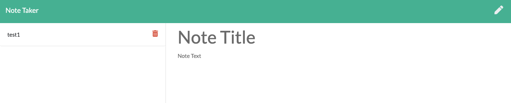
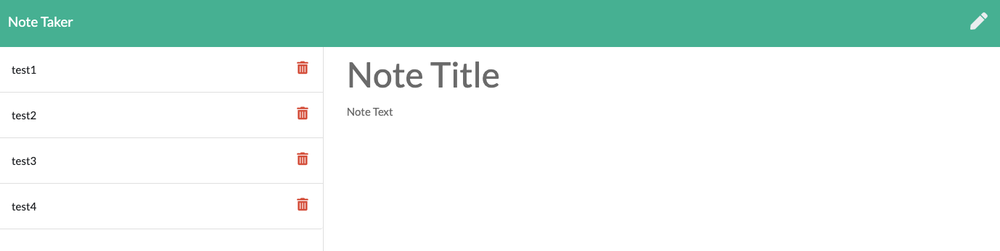
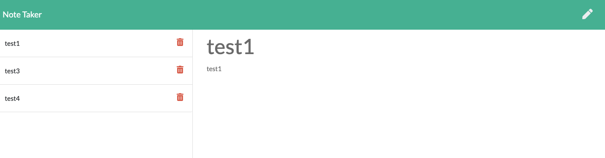

# Note Taker

## Table of Contents

- [Description](#description)
- [How to Install Dependencies](#how-to-install-dependencies)
- [Usage](#usage)
- [License](#license)
- [Contributoring](#contributing)
- [Tests](#tests)
- [Questions](#questions)

## Description

This is an application that can be used to write, save, and delete notes with an express backend. It will save and retrieve note data from a JSON file.

Please find the deployment from here:
https://limitless-escarpment-83186.herokuapp.com/

## How to install dependencies

Please use: npm i

## Usage

Screenshot 1: Once the node is read, the application will outpu the get-started page.

---

Screenshot 2: In the very beginning, there is no saved note and the user gets to input the note data.

---

Screenshot 3: The user can get to save as many notes as he/she wishes.

---

Screenshot 4: User can delete any notes he/she wishes as well (in the screenshot below, test3 is deleted).

---

## License

MIT

## Contributing

Pull requests are welcome. For major changes, please open an issue first to discuss what you would like to change. Also, please make sure to update tests as appropriate.

## Questions

[Email Me!](mailto:nishii.dev.syd@gmail.com)

[Link to my GitHub](https://github.com/noriyuki-ishii-820)
